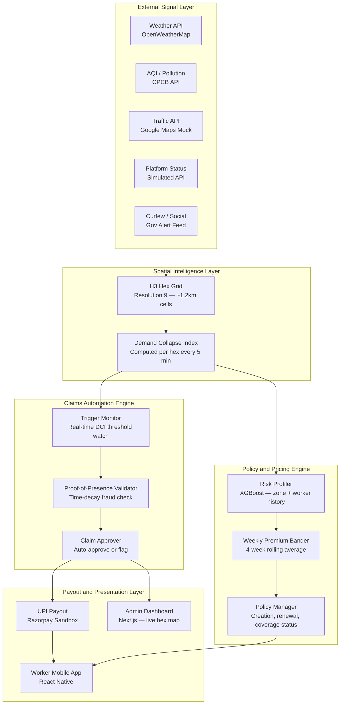
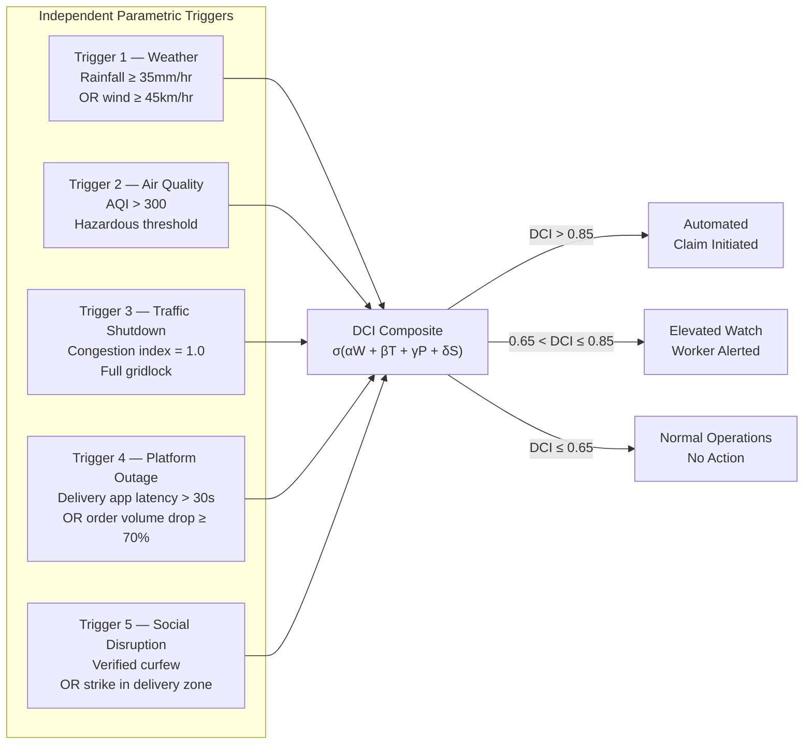
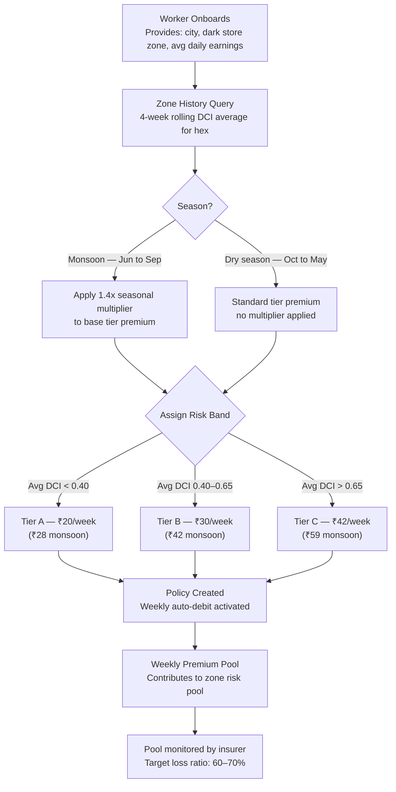
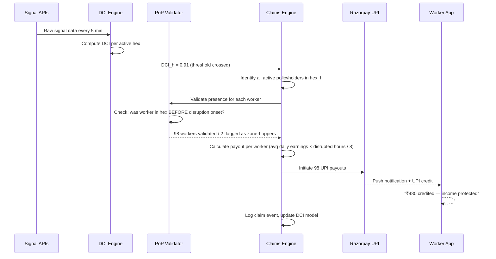
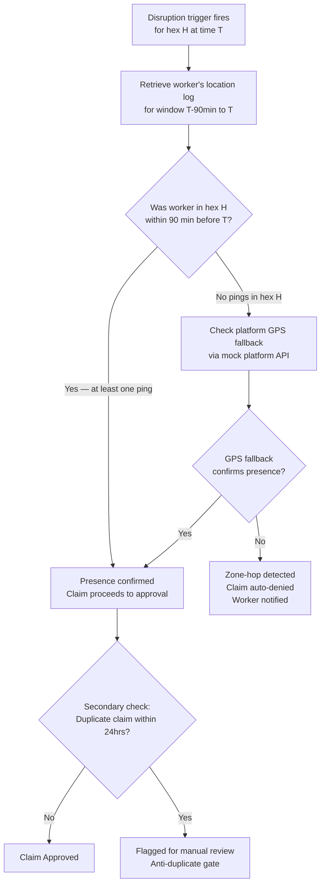

<table align="center">
<tr>
<td align="center">

</td>
<td align="center">

</td>
</tr>
</table>
<div align="center">

<br/>


<br/>


</div>


<div align="center">

🎥 **[Phase 1 Pitch Video — Watch Here](YOUR_LINK_HERE)**

</div>


### 📌 TL;DR

**Problem:** India's Q-commerce delivery partners (Zepto, Blinkit) lose 20–30% of weekly income to external disruptions — with zero financial protection.

**Solution:** gigHood — an AI-powered parametric income insurance platform that detects zone-level economic collapse and pays workers automatically within 90 seconds.

**Core Innovation:** Demand Collapse Index (DCI) — a spatial ML model that proves *income loss*, not just weather events, eliminating basis risk.

**What makes it different:** Zero-touch claims · H3 hex-grid fraud prevention · Weekly pricing aligned to gig earnings cycles · No paperwork ever.


## 📊 The Reality in Numbers

### 📉 Income Loss

| Stat | Source |
|:-----|:-------|
| Gig workers lose **20–30%** of monthly income during disruptions | DEVTrails 2026 Problem Statement |
| Q-commerce order fulfilment drops **60–80%** during heavy rain (>30mm/hr) vs 20–35% for food delivery | RedSeer Consulting, Q-commerce Ops Report 2023 |
| Disruptions occur **3–6 times/month** per dark store zone in monsoon-affected cities | RedSeer Consulting, 2023 |

### 👷 Worker Reality

| Stat | Source |
|:-----|:-------|
| India's gig workforce: **15M+** delivery partners | NITI Aayog, India's Booming Gig Economy 2022 |
| Q-commerce workers report **zero financial buffer** for disruption days | IFMR LEAD gig worker field research, 2022–2024 |
| **No income protection product** currently exists for parametric income loss in this segment | ICRIER Gig Economy Report, 2023 |


## 💬 What Riders Say

<div style="background:linear-gradient(145deg,#161b22,#1f2933); padding:25px; border-radius:12px; border:1px solid #30363d;">

<table>
<tr>
<td width="100" align="center" valign="top">
<br>

<br><br>
<b>⭐⭐</b>
</td>
<td valign="top">
<br>

*❝ When heavy rain hits the city, deliveries slow down or stop completely. That means losing an entire day's earnings. A safety net for days like this would make a huge difference for workers like us. ❞*

**Ravi Kumar**
<br>
🛵 Food Delivery Partner

</td>
</tr>
</table>


<table>
<tr>
<td width="100" align="center" valign="top">
<br>

<br><br>
<b>⭐⭐</b>
</td>
<td valign="top">
<br>

*❝ Some days the heat or pollution becomes unbearable. We cannot ride for long hours, but the bills don't stop. Income protection during such days would change everything. ❞*

**Arjun Singh**
<br>
🛒 Grocery Delivery Rider

</td>
</tr>
</table>


<table>
<tr>
<td width="100" align="center" valign="top">
<br>

<br><br>
<b>⭐⭐⭐</b>
</td>
<td valign="top">
<br>

*❝ When sudden curfews or local shutdowns happen, deliveries stop and we lose the entire day's income. Having an automated insurance system for these disruptions would provide real peace of mind. ❞*

**Imran Shaikh**
<br>
📦 E-commerce Delivery Partner

</td>
</tr>
</table>


</div>

## 📚 Table of Contents

<details open>
<summary><b>📌 Overview</b></summary>

- [📌 TL;DR](#-tldr)
- [📊 The Reality in Numbers](#-the-reality-in-numbers)
- [💬 What Riders Say](#-what-riders-say)

</details>

<details open>
<summary><b>🔍 Problem</b></summary>

- [🔍 Problem Overview](#-problem-overview)
- [🧱 Barriers Gig Workers Face](#-barriers-gig-workers-face)
- [⚡ Disruption Types](#-disruption-types)
- [Why Q-Commerce Workers, Specifically](#why-q-commerce-workers-specifically)

</details>

<details>
<summary><b>🛡️ Solution & Architecture</b></summary>

- [🚀 Proposed Solution — gigHood](#-proposed-solution--gighood)
- [🆚 Why gigHood is Different](#-why-gighood-is-different)
- [01 · Spatial Risk Intelligence (DCI Engine)](#01--spatial-risk-intelligence-dci-engine)
- [02 · Weekly Micro-Insurance (Stable Pricing)](#02--weekly-micro-insurance-stable-pricing)
- [03 · Automated Claim Triggering & Instant Payouts](#03--automated-claim-triggering--instant-payouts)
- [04 · Worker-Centric Smart Application](#04--worker-centric-smart-application)
- [05 · Smart Protection Mode](#05--smart-protection-mode)
- [06 · AI Chatbot Assistant](#06--ai-chatbot-assistant)
- [07–10 · Additional Platform Pillars](#0710--additional-platform-pillars)
- [System Architecture](#system-architecture)

</details>

<details>
<summary><b>⚙️ Core System Design</b></summary>

- [The Demand Collapse Index — Core Intelligence](#the-demand-collapse-index--our-core-intelligence)
- [Parametric Triggers](#parametric-triggers)
- [Weekly Pricing Model](#weekly-pricing-model)
- [Zero-Touch Claims Automation](#zero-touch-claims-automation)
- [Fraud Detection — Time-Decay Proof of Presence](#fraud-detection--time-decay-proof-of-presence)
- [Adversarial Defense & Anti-Spoofing Strategy](#adversarial-defense--anti-spoofing-strategy)
- [🔔 Proactive Coverage Alerts](#-proactive-coverage-alerts)

</details>

<details>
<summary><b>👤 Persona & Use Case</b></summary>

- [👤 Persona & Scenario](#-persona--scenario)
- [📐 Parametric Insurance Model](#-parametric-insurance-model)
- [💰 Weekly Premium Model](#-weekly-premium-model)
- [🎯 Parametric Triggers](#-parametric-triggers)
- [🤖 AI / ML Integration](#-ai--ml-integration)

</details>

<details>
<summary><b>📱 Product & Execution</b></summary>

- [📱 Application Workflow](#-application-workflow)
- [Tech Stack & Architecture](#tech-stack--architecture)
- [Development Plan](#development-plan)

</details>

<details>
<summary><b>📊 Business & Team</b></summary>

- [📈 Business Viability](#-business-viability)
- [👥 Team](#-team)

</details>


## 🔍 Problem Overview

<div align="center">


</div>

<br/>

India's gig economy is the invisible engine behind on-demand urban life. Millions of delivery partners working with **Zomato**, **Swiggy**, **Amazon**, **Flipkart**, **Zepto**, and **Dunzo** ensure fast, reliable fulfillment — yet they operate entirely **without a stable financial safety net**.

Unlike salaried employees, gig workers are compensated **strictly per delivery or per hour worked.** When the environment turns hostile — weather, pollution, civil unrest — they simply **stop earning.**

<div>

<h3>📉 Income Impact on Delivery Partners</h3>

<p>
External disruptions like heavy rain, pollution, and curfews can reduce a delivery partner's earnings by
<b style="font-size:22px;color:#ff6b6b;">20–30%</b> of their monthly income.
</p>


Normal Earnings  
████████████████████ 100%

During Disruptions  
██████████████░░░░░░ 70–80%

<i>Studies and platform reports consistently confirm this trend across major Indian cities.</i>

</div>


## 🧱 Barriers Gig Workers Face

A structural analysis of the compounding vulnerabilities that leave delivery partners financially exposed during operational disruptions.

<table>
<tr>
<td width="50%" valign="top">

### 👷 Worker-Level Barriers

| # | Issue |
|:--|:------|
| 01 | No compensation during forced work stoppages |
| 02 | Daily-earning dependency — **zero financial buffer** |
| 03 | Forced to choose between **safety** and **survival** |
| 04 | No short-term income loss insurance product exists |
| 05 | Even a few-hour disruption causes immediate strain |

</td>
<td width="50%" valign="top">

### 🏗️ Systemic Barriers

| # | Issue |
|:--|:------|
| 01 | Traditional insurance is **slow, complex, dispute-prone** |
| 02 | No product aligned to **weekly earning cycles** |
| 03 | Fraudulent claims risk without smart verification |
| 04 | No dynamic pricing based on real-time risk |
| 05 | No automated disruption detection pipeline |

</td>
</tr>
</table>


## ⚡ Disruption Types

GigHood identifies and responds to **two primary classes of disruptions** that halt delivery operations and eliminate gig worker income:

### 🌧️ Environmental Disruptions

| Disruption | Mechanism | Impact |
|:-----------|:----------|:-------|
| 🌧️ &nbsp;Extreme rainfall & flooding | Roads become impassable | Delivery routes blocked entirely |
| 🌡️ &nbsp;Severe heatwaves | Outdoor temps exceed safety thresholds | Platform suspends operations |
| 🌫️ &nbsp;Hazardous AQI spikes | Air quality crosses danger limits | Workers stop to avoid health risk |
| 🌀 &nbsp;Cyclones & storms | High-wind unsafe for two-wheelers | All outdoor operations halted |
| 🚧 &nbsp;Waterlogged routes | Key corridors flooded | GPS routes unusable |

<br/>

### 🚦 Social & Administrative Disruptions

| Disruption | Mechanism | Impact |
|:-----------|:----------|:-------|
| 🚫 &nbsp;Government-imposed curfews | Movement legally restricted | Zero pickups or drop-offs possible |
| ✊ &nbsp;Local strikes & bandhs | Coordinated shutdowns | Vendor hubs and drop points closed |
| 📣 &nbsp;Political protests | Blocked roads, unsafe conditions | Routing impossible in affected zones |
| 🏪 &nbsp;Sudden market closures | Vendor hubs shut without notice | Fulfillment chain broken |
| 🛑 &nbsp;Mobility restriction orders | Vehicle bans in key areas | Last-mile delivery impossible |


### 📋 How Every Disruption Leads to the Same Outcome

```
+------------------------------------------------------------------------+
|                                                                        |
|  Heavy Rain  ->  Roads unsafe        ->  Deliveries halted   ->  Rs.0  |
|  High AQI    ->  Outdoor work risky  ->  Platform suspends   ->  Rs.0  |
|  Heatwave    ->  Safety hazard       ->  Operations paused   ->  Rs.0  |
|  Curfew      ->  Movement blocked    ->  No pickups/drops    ->  Rs.0  |
|  Bandh       ->  Hubs closed         ->  No fulfillment      ->  Rs.0  |
|                                                                        |
|    Every disruption type  ->  Same outcome for gig workers             |
|               ZERO earnings.    ZERO protection.                       |
|                                                                        |
+------------------------------------------------------------------------+
```


<table>
<tr>

<td width="65%" valign="top">

## Why Q-Commerce Workers, Specifically

The choice of Q-commerce over food delivery or e-commerce is a deliberate design decision, not a label. Three structural properties make this persona the strongest fit for parametric insurance:

**Fixed zone dependency.** Every Zepto or Blinkit partner is geo-fenced to a dark store's delivery radius — typically 1–1.5 km. This radius maps almost exactly to Uber's H3 spatial index at resolution 9 (~1.2 km hexagons). This means our spatial risk model is not an approximation; it is architecturally aligned with how the workers actually earn.

**Predictable disruption correlation.** Q-commerce orders are highly weather-elastic. A 35mm/hr rainfall event does not slow deliveries — it stops them entirely, because two-wheelers cannot safely navigate flooded lanes at speed within a 10-minute SLA. The income-disruption relationship is measurable and consistent, which makes parametric triggers reliable rather than approximate.

**High disruption frequency, low per-event loss.** Unlike a hurricane (catastrophic, rare), Q-commerce workers face moderate disruptions 3–6 times per month in monsoon-affected cities. This frequency makes weekly micro-insurance financially natural and actuarially manageable.

</td>

<td width="35%" align="center">


</td>

</tr>
</table>


<div align="center">


</div>


## 🚀 Proposed Solution — gigHood

<div align="center">


</div>

<br/>

**gigHood** is an AI-powered parametric insurance platform designed specifically for **quick-commerce delivery partners** (Zepto, Blinkit, Instamart).

It transforms traditional insurance into a **real-time, predictive, and automated income protection system** — combining spatial intelligence, disruption detection, micro-insurance, and instant payouts.

Unlike traditional systems that rely on claims, gigHood detects when **earning opportunities in a delivery zone collapse** and compensates workers automatically.

<div align="center">

| ₹20 | 5+1 | 0 | Spatial AI | < 90s |
|:---:|:---:|:---:|:---:|:---:|
| Starting weekly premium | Primary layers + fraud intelligence | Manual claims needed | DCI-based intelligence | Trigger to payout |

</div>


## 🆚 Why gigHood is Different

Most parametric insurance products ask: **"Is it raining?"** — and pay out if it is. gigHood asks: **"Has earning opportunity in this zone actually collapsed?"** — and pays only if it has. This distinction eliminates basis risk entirely.

| Dimension | Weather-Based Insurance | gigHood |
|:----------|:----------------------:|:-------:|
| Trigger | Single weather signal | Multi-signal Demand Collapse Index |
| Spatial precision | City-wide or district | H3 hex-grid — ~1.2km cells |
| Basis risk | High — rain can increase orders | Low — DCI proves income loss |
| Fraud prevention | Absent or basic | Time-Decay Proof-of-Presence engine |
| Claims process | Worker must file | Zero-touch — fully automated |
| Pricing model | Fixed or annual | Weekly, zone-adaptive, IRDAI Sandbox pathway |


### 01 · Spatial Risk Intelligence (DCI Engine)

The core intelligence of gigHood is the **Demand Collapse Index (DCI)** — a spatial model that determines whether income in a delivery zone has collapsed.

Instead of asking *“Is it raining?”*, gigHood asks:

> **“Has earning opportunity in this zone stopped?”**

#### Data Inputs

| Signal | Purpose |
|:------|:--------|
| Weather (rainfall, wind) | Detect delivery-blocking conditions |
| Traffic congestion | Identify mobility breakdown |
| Platform status | Detect delivery outages |
| Social signals | Capture curfew / shutdown events |

#### DCI Formula

DCI = σ(αW + βT + γP + δS)

Where:
- W = Weather severity  
- T = Traffic disruption  
- P = Platform outage  
- S = Social disruption  

σ(x) = 1 / (1 + e^-x)

#### Trigger Condition

If DCI > 0.85 → Zone is **economically disrupted**

→ Claims are triggered automatically

**Capabilities:**
- Hyperlocal disruption detection  
- Income collapse prediction  
- Zone-level risk scoring  


### 02 · Weekly Micro-Insurance (Stable Pricing)

Policies are aligned with the **weekly earning cycle of Q-commerce workers**.

<div align="center">

| Tier | Weekly Premium | Coverage |
|:-----|:--------------:|:---------|
| 🟢 Tier A | ₹20/week | Low-risk zones |
| 🟡 Tier B | ₹30/week | Moderate-risk zones |
| 🔴 Tier C | ₹42/week | High-risk zones |

</div>

Premiums are based on:

→ **4-week rolling average of DCI**

This ensures:
- Stable pricing  
- No sudden spikes  
- Worker trust  


### 03 · Automated Claim Triggering & Instant Payouts

gigHood eliminates manual claim processes entirely.

#### Trigger Conditions

- Rainfall ≥ 35mm/hr  
- AQI > 300  
- Traffic gridlock  
- Platform outage  
- DCI > 0.85  

#### Automated Flow

Disruption detected  
→ Workers in zone identified  
→ Proof-of-Presence validated  
→ Payout calculated  
→ UPI transfer executed (< 90s)  
→ Notification sent  

✅ Zero paperwork  
✅ No claim filing  
✅ Fully automated payouts  


### 04 · Worker-Centric Smart Application


| Feature | Description |
|:--------|:------------|
| Zone Risk Dashboard | Real-time DCI-based disruption risk for worker’s hex zone |
| Safety Radar | H3 hex-based live map showing safe, risky, and disrupted zones |
| Policy Activation | Tier assignment with weekly UPI auto-debit |
| Payout History | Timeline of past disruptions, payouts, and earnings impact |
| Earnings Forecast | AI-based prediction of next-day and weekly income |
| Proactive Tier Alerts | Sunday risk forecast with optional tier upgrade |
| Financial Health Score | Worker stability index based on income consistency |
| AI Chat Assistant | Conversational assistant for policy, payouts, and risk queries |
| Voice AI Assistant | Multilingual voice support (Hindi, Tamil, etc.) |
| Govt Scheme Discovery | Personalized government welfare recommendations |

**User Flow:**

Login → Zone Risk → Plan Selection → Policy Activation → Auto Protection


### 05 · Smart Protection Mode

gigHood continuously monitors **zone-level disruption risk**.

- DCI > 0.75 → Early warning  
- DCI > 0.85 → Auto payout trigger  

Workers stay protected without any manual intervention.


### 06 · AI Chatbot Assistant

gigHood integrates a real-time AI Chat Assistant in Phase 3, making the platform accessible for workers with varying digital literacy.

> *"Workers don't navigate the system — they talk to it."*

The chatbot is powered by the Claude API with the worker's policy context, current DCI score, and last payout injected into each session. It is **read-only and explanatory** — it never files claims or modifies policies.

| Capability | Description |
|:-----------|:------------|
| 🧠 Smart Q&A | Answers policy, payout, and risk queries instantly |
| 📊 Risk Explanation | Explains why DCI is high in plain language |
| 💰 Payout Breakdown | Shows exactly how payout was calculated |
| 🛡️ Policy Guidance | Explains tier differences and upgrade implications |
| 📢 Disruption Context | Conversational summary of active disruption events |

**Supported languages:** Hindi · Kannada · Tamil · Telugu · English


### 07–10 · Additional Platform Pillars

| Pillar | Feature | Description |
|:------:|:--------|:------------|
| 07 | 📊 Financial Health | Stability insights |
| 08 | 🗺️ Safety Radar | Zone-level mapping |
| 09 | 🏛️ Govt Schemes | Welfare integration |
| 10 | 🔐 Fraud Detection | Proof-of-Presence model |


## System Architecture

The platform is composed of five layers: signal ingestion, spatial intelligence, policy and pricing, claims automation, and the payout and dashboard layer.



Each layer is independently deployable and testable. Signal ingestion uses free-tier APIs with mock fallbacks for demo purposes. The spatial layer runs on PostGIS with H3 extension. The claims engine is stateless and event-driven, with DCI recomputation scheduled via APScheduler running inside the FastAPI process.


## The Demand Collapse Index — Our Core Intelligence

The DCI is the mathematical heart of Equix. It answers a single question: **has the local gig economy inside this hex actually stopped?**

We do not ask "is it raining?" — rain sometimes increases Q-commerce orders. We do not ask "is there a curfew?" — curfews sometimes affect only certain hours. We ask: given all observable signals simultaneously, has earning opportunity collapsed below a viable threshold?

### The Formula

$$DCI_h = \sigma\left(\alpha W_h + \beta T_h + \gamma P_h + \delta S_h\right)$$

Where $\sigma$ is the sigmoid function, mapping the raw score to a probability between 0 and 1:

$$\sigma(x) = \frac{1}{1 + e^{-x}}$$

| Variable | Description | Data Source |
|---|---|---|
| $W_h$ | Weather severity score for hex $h$ (rainfall mm/hr, wind speed, AQI) | OpenWeatherMap + CPCB |
| $T_h$ | Traffic congestion index (0–1, normalized) | Google Maps Traffic mock |
| $P_h$ | Platform delivery uptime / latency flag | Simulated platform status API |
| $S_h$ | Social disruption score (curfew, strike, zone closure) | Government alert feed mock |
| $\alpha, \beta, \gamma, \delta$ | ML-derived weights from historical disruption impact | XGBoost model (see cold-start below) |

### Cold-Start Strategy

On Day 1, we have no historical claim data. We solve this with **actuarial priors bootstrapped from open data**:

- IMD (India Meteorological Department) historical rainfall records for the city, mapped to reported delivery downtime from Zepto/Blinkit public incident disclosures.
- Urban mobility disruption datasets from IIT urban transport labs (publicly available).
- Expert heuristic priors: $\alpha = 0.45$, $\beta = 0.25$, $\gamma = 0.20$, $\delta = 0.10$ as starting weights, reflecting weather dominance for Q-commerce.

Weights are updated weekly via online XGBoost retraining as real DCI events and claim outcomes accumulate. The model converges on city-specific weights typically within 6–8 weeks of live operation.

### Trigger Threshold

If $DCI_h > 0.85$, the hex is declared **disrupted** and automated claim processing begins for all active policyholders within that hex.

The 0.85 threshold is not arbitrary. It is initialized based on the historical DCI distribution at which 90% of Q-commerce dark store operations in pilot cities were confirmed halted, cross-referenced against IMD rainfall event logs and Zepto public incident reports. The threshold is tunable per city via the admin dashboard and recalibrates automatically as claim outcomes accumulate — a disruption event where 95%+ of workers in a hex go offline is treated as ground truth for threshold refinement.

### XGBoost's Exact Role

It is important to be precise about what the ML model does and does not do. XGBoost performs two specific tasks: (1) **risk band classification** — assigning each worker to Tier A, B, or C using features including their zone's 12-week DCI history, seasonal weather patterns, proximity to flood-prone areas, and historical claim frequency; and (2) **DCI weight optimization** — updating the α, β, γ, δ coefficients weekly based on actual disruption outcomes. The DCI computation itself is a deterministic sigmoid over those weights — it is not a neural network and does not hallucinate outputs. This distinction matters for regulatory compliance and auditability.


## Parametric Triggers

To satisfy the requirement of 3–5 independent automated triggers, we expose the DCI's component signals as individual triggers *before* they fuse into the composite index. This gives judges a clear checklist while preserving the architectural elegance of the composite model.



Each trigger is independently monitorable and logged. This means a weather-only event (trigger 1 fires, others do not) still flows through the DCI and may or may not cross the 0.85 threshold depending on contextual signals — preventing single-signal false positives while maintaining independent auditability.


## Weekly Pricing Model

### Design Philosophy

Gig workers are extraordinarily price-sensitive. A premium that fluctuates week-to-week based on raw ML output creates distrust and churn. At the same time, a flat premium ignores real risk variation across zones and seasons. We resolve this tension with **Predictive Weekly Risk Bands** computed on a **4-week rolling average** of the hex's DCI history.

### Risk Band Structure

| Band | Weekly Premium | Typical DCI History | Coverage Cap |
|---|---|---|---|
| Tier A — Low Risk | ₹20/week | Rolling avg DCI < 0.40 | ₹600/day × active days |
| Tier B — Moderate Risk | ₹30/week | Rolling avg DCI 0.40–0.65 | ₹700/day × active days |
| Tier C — High Risk | ₹42/week | Rolling avg DCI > 0.65 | ₹800/day × active days |

Using a 4-week rolling average prevents two failure modes: **adverse selection** (premium doesn't spike when a worker is most vulnerable during a predicted cyclone week) and **regulatory concern** (premiums appear stable and predictable to workers and compliance reviewers).

### Pricing Computation Flow




### Regional Risk Recommendations

| Region | Peak Risk Period | Primary Risk | Recommended Coverage |
|:-------|:----------------:|:------------:|:---------------------|
| Delhi | Oct – Feb | AQI spikes | AQI protection add-on |
| Mumbai | Jun – Sep | Monsoon + flooding | Flood coverage |
| Chennai | Nov – Dec | Cyclone + rain | Rain + cyclone bundle |
| Rajasthan | Apr – Jun | Extreme heat | Heatwave protection |
| Bengaluru | Jun – Sep | Monsoon disruption | Rain + traffic bundle |


### Proactive Tier Upgrade for Forecast Events

When the DCI forecast for the *next* week exceeds 0.75 (indicating elevated disruption probability), the worker receives a proactive alert on Sunday evening offering an **optional upgrade to the next higher tier for the coming week's premium cycle**:

> *"High disruption risk forecasted for your zone next week. Upgrade from Tier B to Tier C for next week — pay ₹42 instead of ₹30 and double your daily payout cap to ₹1,400. No action needed if you decline — your Tier B coverage continues."*

This is strictly a weekly pricing decision — the worker is choosing their tier for the next billing week, not purchasing a one-off daily add-on. This preserves the weekly pricing constraint while giving workers financial agency before a foreseeable disruption. The upgrade is voluntary, irreversible for that week once confirmed, and processed as a standard weekly premium payment through the same UPI auto-debit channel.


## Zero-Touch Claims Automation

The defining UX principle of Equix is that **a worker should never need to file a claim**. The system detects, validates, and pays without requiring any worker action. For gig workers with low digital literacy and high stress during disruptions, this is not a feature — it is the product.



### Income Loss Calculation

```
Payout = (Worker's Average Daily Earnings ÷ 8) × Verified Disrupted Hours
```

"Verified disrupted hours" is the duration the hex's DCI remained above 0.85. This prevents full-day payouts for a disruption that cleared in two hours.

Workers declare their average daily earnings at onboarding. This is cross-referenced against the zone's typical earning range to catch inflated declarations — a simple but effective fraud gate at the policy creation stage. Payout caps of ₹600–₹800/day are anchored to real worker earnings data: Q-commerce delivery partners in Tier-1 Indian cities report average daily earnings of ₹520–₹680, with top-decile earners reaching ₹800–₹900 on peak days (IFMR LEAD Gig Worker Income Survey, 2024). The caps are set at the 85th percentile of that distribution, ensuring legitimate high earners are covered without inflating the average claim size.

### Signal API Fallback — Degraded Mode

If fewer than 3 of 5 signal sources are available at computation time (e.g., a traffic API outage or a government feed delay), the DCI computation is paused for that hex and the system enters **degraded monitoring mode**. Workers in the affected hex receive a push notification: *"gigHood is monitoring your zone with reduced signal coverage. Coverage remains active. We will notify you when full monitoring resumes."* Claims are not auto-denied during degraded mode — they are queued for manual review with a 2-hour SLA. This prevents false denials caused by infrastructure failures rather than genuine absence of disruption.


## Fraud Detection — Time-Decay Proof of Presence

Parametric insurance has one dominant fraud vector: **zone hopping** — a worker who is not in the disrupted area drives into it after the trigger fires to collect a payout. The Time-Decay Proof of Presence (PoP) engine eliminates this with minimal computational overhead and no battery-intensive tracking.

### How It Works

The gigHood mobile app sends an **encrypted H3 hex ping every 15 minutes** while the app is in foreground or background. These pings are stored as a lightweight timestamped log:

```
{ worker_id: "w_4821", hex_id: "8928308280fffff", timestamp: "2026-03-14T08:15:00Z" }
```

Background ping reliability is handled explicitly: on Android, pings are dispatched via **WorkManager** with a flex interval, which survives Doze mode and battery optimisation. On iOS, pings use the **BackgroundTasks framework** (BGAppRefreshTask). Since Q-commerce workers already grant persistent foreground location permission to their Zepto/Blinkit delivery apps, the OS treats gigHood as a co-active location service rather than a background-only app, significantly reducing the kill probability. As a fallback, if fewer than 3 pings exist in the 90-minute pre-disruption window, the system defers to the delivery platform's GPS log (retrieved via mock platform API in the demo; via data partnership in production) before making a zone-hop determination.

When a disruption triggers, the PoP engine performs a single historical lookup:



### Additional Fraud Gates

Beyond zone-hopping, Equix applies three secondary checks at the claim processing stage:

**Earnings inflation detection.** Declared daily earnings are compared against the zone's 90th percentile. Declarations above the 90th percentile trigger a soft flag and require secondary validation before payout (not auto-denial — gig workers at peak performance genuinely earn more).

**Claim frequency anomaly.** A worker claiming payouts on more than 60% of their active days over a rolling 4-week period is flagged for review. This catches workers who are gaming the DCI threshold by operating in high-risk zones deliberately.

**Coordinated claim clustering.** If 100% of policyholders in a hex claim on the same event, this is expected and correct. If only a suspiciously small subset claims (e.g., 3 out of 80 active workers), the 3 outliers are flagged — real disruptions affect all workers in a zone, not a precise subset.


## Adversarial Defense & Anti-Spoofing Strategy

<div align="center">


</div>

> **Core Principle: "gigHood verifies order activity — not GPS coordinates."**
>
> The Market Crash scenario is 500 **real registered gig workers** — not bots — who read the same IMD weather forecast, pre-position their spoofed GPS 3 hours before the storm, spread across 25 hexes at 20 per hex, activate manually over a 30-minute window, and have 6 months of legitimate history. Every naive GPS check, density threshold, and sync detector fails against them. gigHood's defense is built for exactly this attacker profile.


### 🔒 Layer 0 — The DCI Anchor (Why the Attack Requires a Real Storm)

The structural guarantee that prevents synthetic fraud events. No worker can trigger a payout without a genuine infrastructure-level disruption.

```
DCI inputs — all external, none from worker devices:
  W  →  OpenWeatherMap rainfall API         (weather station)
  T  →  Traffic congestion index            (road sensor data)
  P  →  Platform delivery uptime            (server-side API)
  S  →  Government curfew / alert feed      (official feed)
```

A GPS spoof into a hex where `DCI = 0.30` triggers nothing. The pool cannot be drained without a real storm. Layer 0 is architecturally unbypassable.

> **To manufacture a false DCI spike, an attacker would need to fake a rainstorm, a traffic shutdown, and a government alert simultaneously. That is not fraud — that is weather control.**


### 1️⃣ The Differentiation — Real Worker vs Pre-Positioned Spoofer

Three gates must all pass before any payout releases. Failing any one routes the claim to manual review regardless of Trust Score.

---

#### Gate 1 — GPS Coordinate Variance Analysis (Defeats the Plugged-In Sleeper Device)

A genuine worker riding through a storm generates GPS readings with measurable jitter — weather interference, movement, signal multipath. A spoofed device emitting from a static home location generates a mathematically perfect coordinate stream.

```
For each PoP ping within the 90-minute window:

Compute:
  Coordinate_Variance  =  std_dev(lat readings) + std_dev(lng readings)
  Accuracy_Variance    =  std_dev(accuracy_radius readings)

Genuine worker in storm:
  Coordinate_Variance:    HIGH  (movement + weather multipath)
  Accuracy_Variance:      HIGH  (signal fluctuation in rain)

Spoofed device (even with injected jitter):
  Coordinate_Variance:    LOW or PATTERN-REGULAR
  Accuracy_Variance:      LOW or ARTIFICIALLY UNIFORM
  (Lockito and similar tools inject jitter algorithmically —
   the noise follows a mathematical pattern, not a physical one)

If Coordinate_Variance < threshold  →  STATIC_DEVICE_FLAG
  Claim routed to Gate 2 verification
```

---

#### Gate 2 — Platform Order Activity Validation (The Hard Gate)

The previous version checked for "Active on Shift" status — which a fraudster at home can achieve by simply opening the Zepto rider app. **The corrected check requires order-level activity, not availability status.**

```
What we check via platform API (mocked in demo, real data partnership in production):

  STRONG confirmation — auto-approved:
    Worker accepted ≥ 1 order OR completed ≥ 1 delivery
    in the 90-minute window before disruption onset
    AND order activity is distributed across the window

    Micro-delivery exclusion: orders where pickup and drop-off
    coordinates are within 100 meters of each other are excluded
    from Gate 2 validation.

  WEAK confirmation — routed to soft queue:
    Worker was Online/Available but no order activity recorded
    (genuine — disruption may have halted all incoming orders)
    → Passive checks run automatically
    → If passive checks clear (Fraud Score < 50): payout released
    → If inconclusive after 2 hours: deferred to end-of-billing-week
      for cross-reference against total weekly platform activity

  NO confirmation — denied:
    Worker was OFFLINE during the window
    Platform shows no session activity in the 90 minutes before disruption

Why this matters:
  A fraudster at home can set themselves as Available on the Zepto app.
  They CANNOT fake completed or accepted orders.
```

**Payout maturation rule:** A worker cannot claim a Tier C payout (₹800/day cap) in a week where their 4-week average premium was Tier A (₹20/week). Maximum payout is capped at 2.5× the worker's 4-week average daily payout history.

---

#### Gate 3 — Velocity Detection (Last-Minute Hopper Filter)

```
If:  distance between last ping outside the claimed hex
     and first ping inside the claimed hex  ÷  time between them
     > 120 km/hr (physically impossible for a 2-wheeler)

Then:  VELOCITY_VIOLATION — routed to soft queue

Limitation: This check detects last-minute zone hoppers only.
Against pre-positioned sleeper cells, Gates 1 and 2 handle that case.
```

---

#### Environmental Signals (Supporting Layer — Not a Gate)

Environmental signals (WiFi vs 4G, GPS jitter patterns, battery drain) contribute to the fraud score but do not gate payouts independently. These signals raise or lower the fraud probability score and influence which verification path a claim takes.


### 2️⃣ Detecting the Distributed Telegram Syndicate

Data points beyond GPS that detect a 500-person ring spread across 25 hexes. The defense operates at the network level across all hexes simultaneously.

---

#### A. Cross-Hex Device Fingerprint Graph (Defeats Sybil Scatter)

```
Fingerprint signals collected at registration:
  - SIM card registration date and carrier
  - gigHood account creation timestamp
  - Device model and Android version
  - GPS mock location provider status (OS-level flag, detectable
    regardless of spoofing method)

Cross-hex graph query at every disruption event:
  Flag conditions (relative to historical hex composition baseline):

  →  OS-level mock location provider active on ≥ 25 accounts
     distributed across multiple hexes in same event
     →  MOCK_LOCATION_NETWORK flag

  →  ≥ 50 accounts registered on gigHood within the same 72-hour window
     claiming in different hexes simultaneously
     →  REGISTRATION_COHORT flag

  →  Device model frequency in this event exceeds 3× the
     historical baseline frequency for that model in those hexes
     →  MODEL_CONCENTRATION flag (relative, not absolute threshold)
```

**Note on device model detection:** All device model flags use **relative frequency vs historical hex baseline**, not absolute counts. This prevents false positives in Tier-1 Indian cities where a small number of budget models dominate the gig worker market.

---

#### B. Uniform Partial Participation Anomaly (Probabilistic Signal)

```
Organic expectation:  High variance — some hexes 45%, others 88%
Fraud signal:         Low variance — most hexes clustering in a narrow band

Contribution:  +15 to fraud score if variance is statistically low
               Does NOT independently freeze claims
```

---

#### C. Coordinated Entry Window (Probabilistic Signal)

```
Organic expectation:  Different hexes activate at different times
Fraud signal:         Multiple hexes showing entry clusters in the same
                      narrow time band

Contribution:  +10 to fraud score if cross-hex entry correlation is high
```

---

#### D. Earnings Declaration Distribution Check

```
Fraud signal:  Spike of declarations clustering just below the 90th percentile
               threshold — statistically inconsistent with organic distribution
               →  DECLARATION_CLUSTERING flag
               →  Affected accounts routed to soft queue for re-verification
```

---

#### E. H3 Hex Density Cap

```
Per-hex capacity:  ~50–80 active Q-commerce riders (operational estimate)
Flag threshold:    > 90 claims from one hex  →  CAPACITY_VIOLATION
```

---

#### F. Compound Fraud Probability Score

```
Fraud_Score = (Gate 1 variance flag × 30)
            + (Gate 2 order activity status × 40)
            + (OS mock location flag × 20)
            + (Registration cohort flag × 15)
            + (Model concentration flag × 10)
            + (Participation variance flag × 15)
            + (Entry window correlation × 10)
            + (Declaration clustering flag × 10)

Score < 30:   Path 1 — Fast Track
Score 30–59:  Path 2 — Soft Queue
Score 60–79:  Path 3 — Active Verify
Score ≥ 80:   Path 4 — Denied + Appeal
```

Gate 2 (order activity) carries the highest weight because it is the least gameable signal. A fraudster at home cannot fake completed deliveries.


### 3️⃣ The UX Balance — Protecting Honest Workers

> **Design Rule: Order activity is the gate. Everything else determines speed.**

#### The Four-Path Response Framework

```
Path 1 — FAST TRACK
  Conditions:   Gate 2 STRONG (order confirmed) + Fraud Score < 30
  Action:       Payout released automatically within 90 seconds
  Worker sees:  "₹480 credited — income protected"

Path 2 — SOFT QUEUE
  Conditions:   Gate 2 WEAK (online, no orders) OR Fraud Score 30–59
  Action:       Passive verification — no worker action needed
  SLA:          2 hours
  Worker sees:  "Your payout is being verified — we'll notify you shortly"

Path 3 — ACTIVE VERIFY
  Conditions:   Gate 2 STRONG + Fraud Score 60–79
  Action:       1-tap FCM prompt — worker confirms current position
  SLA:          30 min for HIGH trust, 2 hours for others
  Worker sees:  "We noticed unusual activity near your zone.
                 Tap here to confirm your location — takes 5 seconds."

Path 4 — DENIED + APPEAL
  Conditions:   Gate 2 NO CONFIRMATION (OFFLINE) OR Fraud Score ≥ 80
  Action:       Claim denied, appeal link provided
  Worker sees:  "We couldn't verify your shift activity during this event.
                 If you were working, tap here to raise a support ticket."
```

---

#### Human Review Scalability Framework

```
Priority 1 (< 1 hour):   WEAK Gate 2 + HIGH Trust Score
Priority 2 (< 2 hours):  WEAK Gate 2 + MEDIUM Trust Score
Priority 3 (< 4 hours):  NO Gate 2 + HIGH Trust Score (app crash / connectivity)
Priority 4 (< 8 hours):  NO Gate 2 + LOW Trust Score + HIGH Fraud Score

Auto-scaling: If Priority 1 queue exceeds 100 workers,
  cross-reference last 4-week shift schedule against claimed hex assignment.
  If consistent → auto-approve. If inconsistent → escalate to Priority 3.
```

---

#### Trust Score Dampening During High-Risk Events

```
Trust Score reduces fraud score by max 10 points during high-risk events.

Trust Score CANNOT:
  →  Override a Gate 2 NO CONFIRMATION verdict
  →  Convert a Fraud Score ≥ 80 into auto-approval
  →  Bypass the payout maturation cap
```

---

#### The Cluster Suppression Protocol

```
Step 1:  Cross-hex fingerprint graph detects DISTRIBUTED_RING
Step 2:  Identify workers in flagged hexes with organic patterns:
           - Gate 2 STRONG (order confirmed)
           - OS mock location flag: absent
           - Fraud Score < 30
Step 3:  Release these workers via Path 1 immediately — unaffected
Step 4:  Apply compound fraud score to flagged cluster accounts
Step 5:  Log full cluster event for insurer admin dashboard
```

Honest workers in the same hexes as an attack are never penalized as long as they have confirmed order activity. The suppression is surgical: score-based, not geography-based.

---

#### Final Defense Architecture

```
Layer 0  →  DCI cannot be spoofed (external infrastructure only)
Layer 1  →  GPS coordinate variance (movement physics — not ping count)
Layer 2  →  Platform order activity (deliveries, not "online" status)
Layer 3  →  Payout maturation cap (destroys trust-farm upgrade ROI)
Layer 4  →  OS-level mock location detection (method-agnostic spoofing flag)
Layer 5  →  Cross-hex network graph (distributed ring visible at event level)
Layer 6  →  Compound fraud score (probabilistic, multi-signal)
Layer 7  →  Triage-prioritized human review (scales under mass event load)
```

> **"Fraud does not appear as anomalies — it appears as statistically normal behavior replicated at scale. Our defense validates consistency across order activity, coordinate physics, platform-confirmed history, and cross-hex network structure — not any single signal."**


## 🔔 Proactive Coverage Alerts

This feature transforms Equix from a reactive payout tool into a **forward-looking financial tool** — the single most important UX differentiator.

Every Sunday evening, the DCI forecasting model (using 7-day weather forecasts fused with historical DCI patterns) computes a next-week risk score for each active hex. Workers in elevated-risk zones receive a push notification:

```
🌧️ gigHood Alert — Next Week Risk Score: HIGH (0.79)

Your zone shows elevated disruption probability next week.
Your current tier: Tier B — ₹700/day coverage

Upgrade to Tier C for next week — ₹42 instead of ₹30.
Coverage doubles to ₹1,400/day for the full week.

Offer closes tonight at midnight.
Your next weekly premium will reflect your choice.

[Upgrade to Tier C]  [Keep Tier B]
```

This serves three purposes simultaneously:

1. **Worker value perception.** The worker sees the system is watching for them before anything has gone wrong. This reduces churn dramatically and builds the kind of trust that drives word-of-mouth in tight-knit dark store communities.
2. **Pool solvency management.** Voluntary tier upgrades add premium revenue precisely when expected claim costs are higher, improving the insurer's loss ratio without coercive or dynamic repricing.
3. **Financial agency.** Gig workers currently have no tools to manage income risk proactively. Equix gives them a weekly decision they can make with full information — the risk score, the cost, and the upside — before a disruption hits.


# 👤 Persona & Scenario

### Ravi Kumar — Primary Persona

<table>
<tr>
<td width="40%" align="center">


</td>

<td width="60%" valign="top">

| Attribute | Detail |
|:----------|:-------|
| Age | 26 |
| City | Bengaluru |
| Platform | Zepto / Blinkit |
| Work Model | Dark store-based delivery (2–3 km radius) |
| Average weekly income | ₹4,500 |
| Best week | ₹6,200 |
| Worst monsoon week | ₹1,800 |
| Vehicle | 2-wheeler |
| Device | Android smartphone |
| Payment method | UPI |

> *"If heavy rain shuts down my zone, I lose the entire day's income."*

</td>
</tr>
</table>


### Ravi's Week with gigHood

#### 🟢 Monday Morning — Policy Activation
- Opens **gigHood app**
- Views **zone-level risk (DCI score)**
- Assigned **Tier B plan — ₹30/week**
- Payment auto-deducted via UPI  
- ✅ Policy activated instantly  


#### 🌧 Wednesday — Disruption Detected
- Rainfall exceeds **35mm/hr** in Ravi’s hex zone  
- **DCI recalculated → crosses 0.85 threshold**  
- Zone marked as **economically disrupted**  
- System identifies all active workers in the zone  
- **Proof-of-Presence (last 90 mins) → Valid**  
- Payout calculated based on disrupted hours  
- 💰 **₹480 credited via UPI**  


#### 🌙 Wednesday Evening — Outcome
- Notification received:  
  > *"₹480 credited — income protected"*  
- No claim filed  
- No manual action required  
- ✅ Fully automated protection


## 🎯 Why This Persona Matters

Quick-commerce delivery partners operate within **fixed hyperlocal zones (1–3 km radius)** centered around dark stores.

This makes them uniquely suitable for gigHood because:

- Disruptions are **zone-specific**, not city-wide  
- Income can drop to **zero instantly**  
- Work is highly dependent on **mobility and platform uptime**  

gigHood’s **H3 spatial model + DCI engine** aligns directly with this operational structure, enabling precise disruption detection and automated compensation.


## 📐 Parametric Insurance Model

### Traditional vs Parametric

| Dimension | Traditional Insurance | Parametric (gigHood) |
|-----------|---------------------|----------------------|
| Trigger | Individual loss verified | Zone-level disruption (DCI threshold) |
| Claim filing | Manual, documented | **None required** |
| Settlement time | Weeks to months | **Minutes (< 90s)** |
| Proof required | Extensive documentation | **Zero** |
| Fraud surface | High (self-reported) | **Low (objective signals + PoP)** |
| Suitable for gig workers | ❌ | ✅ |

---

### End-to-End Parametric Flow

    External signals detected (weather, traffic, platform status)
            |
            v
    DCI computed for each zone
            |
            v
    DCI > 0.85 → Zone marked as disrupted
            |
            v
    Active workers in zone identified
            |
            v
    Proof-of-Presence validation (last 90 mins)
            |
            v
    Payout calculated based on disruption duration
            |
            v
    UPI transfer executed via Razorpay
            |
            v
    Worker notified via app + WhatsApp

**No claim. No paperwork. No delay.**

---

## 💰 Weekly Premium Model

### Protection Tiers

| Tier | Weekly Premium | Coverage |
|------|--------------|----------|
| 🟢 Tier A | ₹20 | Low-risk zones |
| 🟡 Tier B | ₹30 | Moderate-risk zones |
| 🔴 Tier C | ₹42 | High-risk zones |

### Pricing Logic

Premiums are determined using:

**4-week rolling average of zone-level DCI**

| Factor | Impact |
|--------|--------|
| Historical disruption frequency | Higher risk → higher tier |
| Seasonal patterns (monsoon/cyclone) | Temporary risk adjustment |
| Zone-specific conditions | Localized pricing |

This ensures:
- Stable weekly pricing  
- No sudden spikes  
- Predictable cost for workers  

---

## 🎯 Parametric Triggers

gigHood monitors real-world signals affecting quick-commerce delivery zones.

| Trigger | Threshold | Source | Effect |
|---------|----------|--------|--------|
| 🌧 Heavy Rain | ≥ 35mm/hr | OpenWeatherMap | Roads unusable |
| 🌫 AQI Spike | AQI > 300 | CPCB | Unsafe outdoor work |
| 🚧 Traffic Gridlock | Congestion = 1.0 | Maps API | Movement blocked |
| 📵 Platform Outage | High latency/downtime | Platform API | Orders stop |
| 🚫 Curfew / Bandh | Govt restriction | Alert feeds | Zone shutdown |
| 🌀 Cyclone Warning | Active alert | IMD | Full disruption |

All triggers feed into:

**Demand Collapse Index (DCI)**

Final payout is based on combined signals, not a single trigger.

---

## 🤖 AI / ML Integration

gigHood uses controlled and explainable machine learning.

### Core Components

| Component | Model | Role |
|-----------|-------|------|
| Risk Scoring | XGBoost | Zone disruption probability |
| Forecasting | LSTM | Weather & AQI prediction |
| Fraud Detection | Rule-based checks | Claim validation |

---

### ML Pipeline

    External APIs (Weather, AQI, Traffic, Platform)
            |
            v
    Data Ingestion Layer
            |
            v
    Feature Engineering (zone-level)
            |
            v
    DCI Computation Engine
            |
            v
    Trigger Detection
            |
            v
    Proof-of-Presence Validation
            |
            v
    Automated Payout Execution

---

### Fraud Prevention — Proof of Presence (PoP)

Instead of generic fraud scoring, gigHood uses time-based location validation.

Rule:

    Worker must be present in the affected zone
    within 90 minutes before disruption

| Check | Purpose |
|------|--------|
| Location history | Prevent zone hopping |
| Earnings validation | Prevent inflation |
| Claim frequency | Detect abnormal patterns |

---

## 📱 Application Workflow

### Worker Onboarding

    1. Download gigHood app
    2. Register via mobile + OTP
    3. Auto-detect work zone
    4. Risk profile generated using DCI history
    5. Tier assigned automatically
    6. Weekly premium activated via UPI
    7. Protection starts instantly

---

### Weekly Policy Cycle

    Monday     → Premium auto-deducted
                  Policy active for 7 days

    During week → DCI monitored continuously
                  If threshold crossed → payout triggered

    Sunday     → Weekly summary sent
                  (coverage, payouts, next week risk)

---

### End-to-End Payout Flow (< 90 seconds)

    Disruption detected (DCI > 0.85)
      └── Worker in affected zone
      └── Policy active
      └── Proof-of-Presence validated
      └── Payout calculated
      └── UPI transfer executed
      └── Notification sent


### Voice AI Assistant

Workers interact naturally — no reading required.

```
Worker speaks  →  "What happens if it rains tomorrow?"
                         |
                         v
              Speech-to-text transcription
                         |
                         v
          LLM generates plain-language response
          (Claude / GPT-4 + worker profile context)
                         |
                         v
       Text-to-speech in worker's preferred language
```

**Supported languages:** Hindi · Kannada · Tamil · Telugu · English


## Tech Stack & Architecture

### MVP Stack — What We Build and Demo (Free Tier, Zero Cost)

| Layer | Technology | Justification |
|------|------------|---------------|
| Worker App | React Native (Expo) | Native background location APIs required for PoP fraud engine |
| Admin Dashboard | Next.js + Tailwind CSS on Vercel free tier | SSR for live data; Vercel free tier handles full demo load |
| Backend API | Python + FastAPI | Native ML model serving; async endpoints for DCI computation |
| Scheduled Jobs | APScheduler (in-process) | DCI recomputation every 5 min inside FastAPI — no Redis needed |
| ML Models | XGBoost + Scikit-learn | Risk band classification + DCI weight optimization |
| Database | Supabase free tier (PostgreSQL + PostGIS) | PostGIS + H3 extension pre-enabled; 500MB free |
| Spatial Index | H3 Python library | Hex-grid computation |
| Payments | Razorpay Sandbox | UPI payout simulation; fully free in test mode |
| Notifications | Firebase FCM (free tier) | Push notifications to worker app |
| Signal APIs | OpenWeatherMap free tier, CPCB AQI API, Maps mock, Gov alert mock | All free or mocked |
| Backend Hosting | Render free tier | Hosts FastAPI + APScheduler |

### Scaled Production Stack (Post-Hackathon Roadmap)

| Layer | Technology |
|------|------------|
| Backend Hosting | AWS ECS (containerized) |
| Database | AWS RDS PostgreSQL + TimescaleDB (time-series) |
| Cache / Queue | Redis + Celery workers |
| API Gateway | Kong |
| Secondary Service | Node.js microservice for notification routing |
| ML Forecasting | Retrained seasonal model (XGBoost time-series variant) |


### Microservices

| Service | Responsibility |
|--------|---------------|
| Policy Engine | Tier assignment, activation, renewal |
| Risk Engine | DCI computation, zone risk scoring |
| Trigger Monitor | Real-time signal ingestion + threshold detection |
| Claim Engine | Payout calculation + orchestration |
| Fraud Detection | Proof-of-Presence validation |
| Payment Service | Razorpay UPI payouts |
| Notification Service | WhatsApp + push alerts |
| Auth Service | OTP login, JWT |


## Development Plan

### Phase 1 — Ideation & Foundation (Weeks 1–2) ✅ Complete

- [x] Problem research and persona selection (Q-commerce)
- [x] Parametric trigger design
- [x] DCI-based architecture design
- [x] Weekly pricing model (₹20–₹42 tiers)
- [x] System architecture planning
- [x] README setup

---

### Phase 2 — Core Development (Weeks 3–5)

- [ ] Backend APIs (FastAPI + Node.js)
- [ ] Database setup (PostgreSQL + TimescaleDB)
- [ ] External API integration (Weather, AQI, Traffic)
- [ ] H3 spatial grid implementation
- [ ] Trigger detection engine
- [ ] Mobile app UI (onboarding + dashboard)

---

### Phase 3 — Intelligence Layer (Weeks 6–8)

- [ ] XGBoost risk model (DCI weight tuning)
- [ ] LSTM forecasting model (weather trends)
- [ ] DCI computation pipeline
- [ ] Zone-level disruption detection
- [ ] Proof-of-Presence validation system

---

### Phase 4 — Automation & Payments (Weeks 9–10)

- [ ] Razorpay UPI integration
- [ ] Automated claims engine
- [ ] Notification system (WhatsApp + FCM)
- [ ] Admin dashboard (zone monitoring)

---

### Phase 5 — Testing & Demo (Weeks 11–12)

- [ ] End-to-end testing
- [ ] Load testing (multi-zone simulation)
- [ ] Demo scenario setup
- [ ] Final submission


## 📈 Business Viability


### Market Opportunity

| Metric | Value |
|-------|-------|
| Gig workforce (India) | 15M+ |
| Projected (2030) | 23.5M |
| Target (hyperlocal workers) | 8M |
| Market size | ₹6,000+ crore |

---

### Revenue Streams

| Stream | Model | Description |
|--------|------|------------|
| Weekly premiums | B2C | Primary revenue |
| Platform partnerships | B2B | Integration with delivery platforms |
| Insurance APIs | B2B | License DCI engine |
| Data insights | SaaS | Urban disruption analytics |

---

### Unit Economics (Tier B Example)

```
Weekly premium: ₹30
Expected payout: ₹19.5 (65% loss ratio)
Operating cost: ₹5
Gross margin: ₹5.5 per user per week

At 100,000 users → ₹5.5 lakh/week margin
```


## 👥 Team

<div align="center">

**GigHood — Guidewire DEVTrails Hackathon 2026**

*Building the future of financial protection for India's gig workers through AI-powered parametric income insurance.*

</div>

<br/>

<table align="center">
<tr>

<td align="center" width="160">

<br/><b>Vishnu Gupta</b>
<br/><sub>Team Leader</sub>
</td>

<td align="center" width="160">

<br/><b>Abhay Kumar</b>
<br/><sub>Team Member</sub>
</td>

<td align="center" width="160">

<br/><b>Ananya Agarwal</b>
<br/><sub>Team Member</sub>
</td>

<td align="center" width="160">

<br/><b>Krishna Somani</b>
<br/><sub>Team Member</sub>
</td>

<td align="center" width="160">

<br/><b>Praveen Kumar</b>
<br/><sub>Team Member</sub>
</td>

</tr>
</table>


<div align="center">


<br/>


</div>


